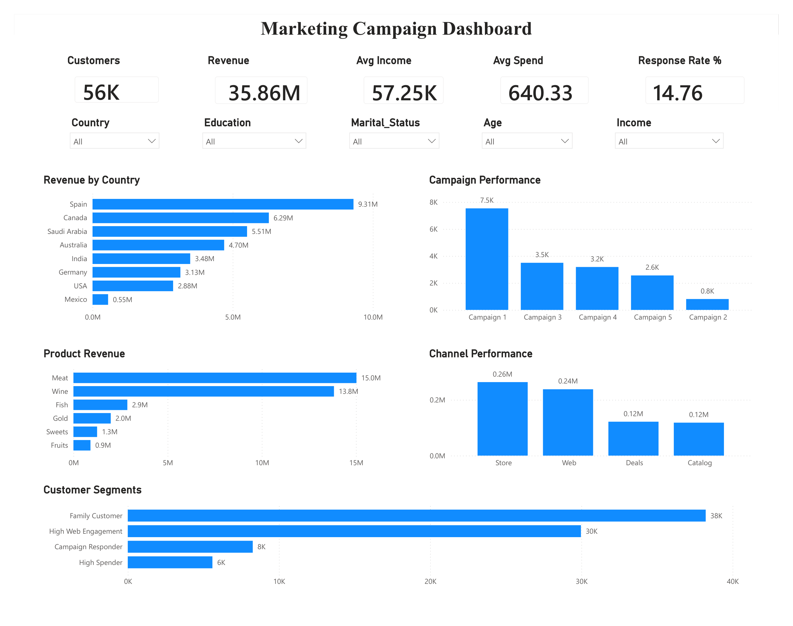
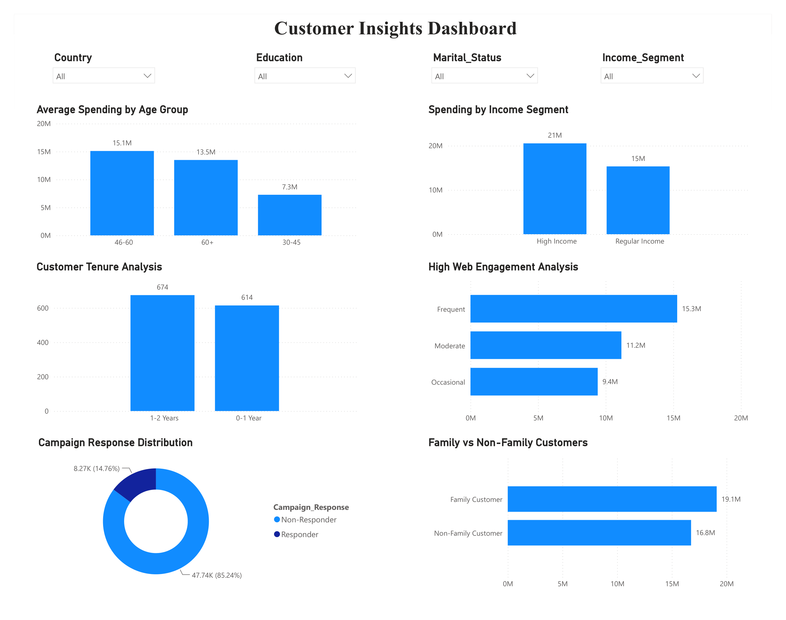

# 📊 Marketing Campaign Analysis

## Project Overview

This project analyzes customer demographics, purchasing behavior, and marketing campaign performance for a retail company. The objective is to uncover customer insights, evaluate campaign effectiveness, and provide actionable business recommendations using Python, MySQL, and Power BI.

---

## Problem Statement

The company has conducted multiple marketing campaigns but needs a better understanding of:

- Which customers generate the highest revenue?
- Which campaigns perform best?
- Which products and channels contribute most to sales?
- Which customer segments should be targeted for future campaigns?

---

## Business Objectives

- Clean and preprocess marketing data
- Perform Exploratory Data Analysis (EDA)
- Engineer meaningful customer features
- Build reusable SQL views
- Develop interactive Power BI dashboards
- Generate business insights and recommendations

---

## Tech Stack

- Python
- Pandas
- NumPy
- Matplotlib
- Seaborn
- MySQL
- Power BI
- Jupyter Notebook
- VS Code

---

## Dataset Features

- Customer Demographics
- Income
- Spending by Product Category
- Purchase Channels
- Campaign Responses
- Customer Tenure
- Web Activity
- Family Information

---

## Project Workflow

1. Data Cleaning & Preprocessing
2. Feature Engineering
3. Exploratory Data Analysis
4. Customer Segmentation
5. SQL Database & Views
6. Power BI Dashboard Development
7. Business Insights & Recommendations

---

## SQL Views

- vw_kpi_summary
- vw_country_revenue
- vw_campaign_summary
- vw_product_summary
- vw_channel_summary
- vw_channel_totals
- vw_segment_summary

---

## Dashboards

### Executive Dashboard



Displays:

- Total Customers
- Total Revenue
- Average Income
- Average Spend
- Response Rate
- Revenue by Country
- Product Revenue
- Campaign Performance
- Channel Performance
- Customer Segments

### Customer Insights Dashboard



Displays:

- Spending by Age Group
- Spending by Income Segment
- Customer Tenure
- Campaign Response Distribution
- Web Engagement
- Family vs Non-Family Customers

---

## Key Insights

- Spain generated the highest revenue.
- Meat and Wine products contributed the largest share of revenue.
- Premium-income customers had the highest response rates.
- Seniors (60+) were the most valuable customer segment.
- Frequent website visitors were not the highest spenders, highlighting an opportunity to improve online conversion.
- Approximately 30% of customers were identified as an under-served segment with high engagement but low spending.

---

## Business Recommendations

- Prioritize premium-income customers for future campaigns.
- Improve website conversion for high-traffic, low-spend customers.
- Increase retention efforts for high spenders.
- Focus marketing on high-performing products and channels.
- Reassess low-performing campaign formats.

---

## Repository Structure

```text
Marketing-Campaign-Analysis/
│
├── data/
├── notebooks/
├── sql/
├── dashboard/
├── report/
├── screenshots/
├── docs/
├── README.md
├── requirements.txt
└── .gitignore
```

## How to Run

1. Clone the repository.
2. Install dependencies using:

```bash
pip install -r requirements.txt
```

3. Open the Jupyter Notebook for Python analysis.
4. Import SQL scripts into MySQL.
5. Open the `.pbix` file in Power BI Desktop.

---

## Future Enhancements

- Predictive model for campaign response
- Customer Lifetime Value (CLV) analysis
- RFM Segmentation
- Streamlit web application
- Automated data refresh

---

## Author

**Mubeen Tabassum F**

Project completed as part of a Data Analytics capstone using Python, SQL, and Power BI.
